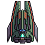

.. SpaceShooter2D-Pygame documentation master file, created by
   sphinx-quickstart on Sat Jan 18 02:57:52 2025.
   You can adapt this file completely to your liking, but it should at least
   contain the root `toctree` directive.

SpaceShooter2D-Pygame documentation
===================================

Welcome to SpaceShooter2D-Pygame's documentation.
Click this
`link <modules.html>`_
to check the list of all classes.

.. toctree::
   :maxdepth: 2
   :caption: Contents:

